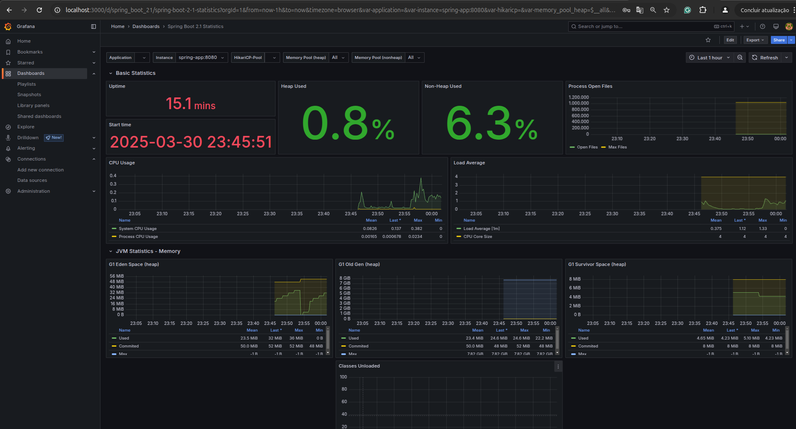

# revenda-challenge

# Aplicação Spring Boot com Docker

Este projeto é uma aplicação Spring Boot que pode ser testada utilizando Docker. Abaixo estão as instruções para rodar a aplicação e testar os endpoints.

## Faça o deploy da aplicação apra utilizar os container.

Eu não subi a imagem da aplicação para o docker hub, então por gentileza, caso queiram testar a aplicação utilizando o compose, faça o deploy do projeto utilizando o comando:

````mvn package````

## Rodando a Aplicação com Docker Compose
Foi criado um Dockerfile e um arquivo docker-compose.yml para facilitar a execução e os testes da aplicação de forma rápida. Para rodar a aplicação, 
siga os passos abaixo na raíz do projeto (mesma pasta do docker-compose.yml). É necessário ter o Docker Compose instalado na sua máquina.
### Comando
No terminal, execute:
````
docker-compose up -d
````

## Acesso à Aplicação

Após subir os containers, você pode acessar os seguintes serviços:

- **Spring Boot App:** [http://localhost:8080](http://localhost:8080)
- **Prometheus:** [http://localhost:9090](http://localhost:9090)
- **Grafana:** [http://localhost:3000](http://localhost:3000)  
  **Usuário e Senha (Grafana):** `admin / admin` talvez só logue na segunda tentativa.

## Funcionalidades

A aplicação utiliza:

- **Scheduler do Spring:** Para agendar tarefas em segundo plano.
- **Spring Retry:** Para implementar lógica de repetição em chamadas que podem falhar temporariamente.

## Configuração do Grafana

Para visualizar as métricas do Prometheus no Grafana, siga os passos abaixo:

1. Vá para **Connections** > **Data Sources**.
2. Selecione **Prometheus**.
3. Adicione a seguinte URL no campo **URL:**  
   `http://prometheus:9090`
4. Salve a configuração clicando em **Save & Test**.

### Adicionando um Dashboard

Você pode adicionar dashboards para visualizar gráficos no Grafana. Você pode encontrar dashboards prontos no site oficial do Grafana: [Grafana Dashboards](https://grafana.com/grafana/dashboards/).

Ou você pode usar o dashboard de **Spring Boot 2.1 Statistics** com o seguinte ID: `10280`.



## Testando os Endpoints

Aqui estão os endpoints disponíveis na API:

### 1. Obter todos os clientes
GET http://localhost:8080/api/customer

### 2. Criar um novo cliente
POST http://localhost:8080/api/customer
**Payload:**
```json
{
  "cnpj": "21.888.453/0001-88",
  "razaoSocial": "Secreta",
  "nomeFantasia": "Secreta S.A",
  "email": "empresa@example.com",
  "telefone": [
    "12345-6789",
    "98765-4321"
  ],
  "nomesDeContato": [
    {
      "nome": "João Silva",
      "principal": false
    },
    {
      "nome": "Maria Oliveira",
      "principal": true
    }
  ],
  "enderecoDeEntrega": [
    "Rua Exemplo, 123, Bairro, Cidade, Estado, 12345-678"
  ]
}
```

### 3. Obter um cliente pelo ID
GET http://localhost:8080/api/customer/{{id}}

### 4. Atualizar um cliente
PUT http://localhost:8080/api/customer/{{id}}

### 5. Deletar um cliente
DELETE http://localhost:8080/api/customer/{{id}}

### 6. Criar um novo pedido
POST http://localhost:8080/api/order
````
{
  "customerId": "67e594a87d10b81b098ecb56",
  "produtos": [
    {
      "nome": "Brahma",
      "descricao": "350ml",
      "preco": 7.0,
      "quantidade": 900
    }
  ]
}
````


